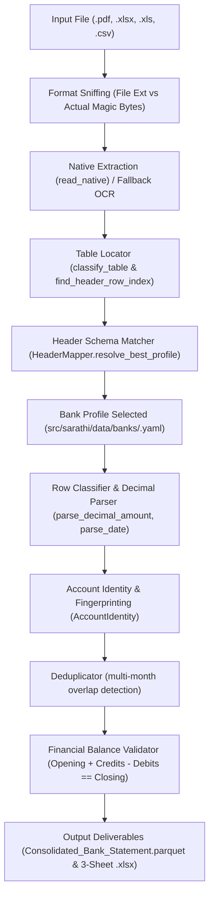

# Bank Statement Schema Mapping & Onboarding Guide

`Vedas/Bank_Statement_Mapping_Guide.md` is the canonical reference for ingesting, profiling, and mapping new bank statement formats into Sarathi. It enables any developer or AI assistant to onboard new bank formats immediately without re-explaining the architecture.

---

## 1. Subsystem Architecture & Ingestion Flow

Bank statement extraction and normalization is owned by `sarathi.shakti.bank_statements`. It executes in a deterministic, zero-network, Decimal-precision pipeline:



---

## 2. File Format vs Actual Hidden Format Sniffing

Indian banks export statements under misleading file extensions. The ingestion pipeline sniffs content by magic bytes and binary signatures (`sarathi.shakti.native_extraction.detector`):

| Declared Extension | Actual Hidden Binary Format | Sniffing Signature | Engine Handling |
| :--- | :--- | :--- | :--- |
| `.xls` | **HTML Web Table** | `b"<html"` or `<table` | `HTML_TABLE` reader extracts `<td>` cells directly into structured tables. |
| `.xls` | **SpreadsheetML 2003 XML** | `xmlns="urn:schemas-microsoft-com:office:spreadsheet"` | `SPREADSHEET_ML` XML parser. |
| `.xls` | **Legacy OLE / BIFF8** | `b"\xd0\xcf\x11\xe0\xa1\xb1\x1a\xe1"` | Calamine / legacy BIFF parser. |
| `.xlsx` | **OpenXML Package** | `b"PK\x03\x04"` with `xl/workbook.xml` | Calamine / openpyxl reader. |
| `.csv` | **UTF-16LE / TSV / Pipe** | BOM `b"\xff\xfe"` or `\t` / `\|` delimiters | `DelimitedReader` with automatic delimiter & encoding sniff. |
| `.pdf` | **Vector Text PDF** | `b"%PDF-"` with stream font glyphs | PyMuPDF text & vector table reconstruction. |
| `.pdf` | **Scanned Image PDF** | `b"%PDF-"` with image-only pages | Automatic continuation handoff to `ocr`. |

> [!IMPORTANT]
> Never assume the file extension reflects the real format. Always inspect the underlying container before diagnosing extraction failures.

---

## 3. Dynamic Header Schema & Data Pattern Matcher (`resolve_best_profile`)

Sarathi does not rely solely on bank logo text or isolated header strings. It uses **Dynamic Header Schema & Lightweight Data Pattern Matching**:

1. **Header Extraction**: When a transaction table is located, its header cells (`hdr_cells`) and data rows (`data_rows`) are extracted.
2. **Lightweight Data Sampling (`extract_sample_data_rows`)**:
   Without extra overhead, the engine inspects:
   - **First 3 rows** (`data_rows[:3]`) — Opening transactions / top records.
   - **Middle distributed sample rows** — Typical mid-statement entries.
   - **Last 3 rows** (`data_rows[-3:]`) — Closing transactions / bottom records.
3. **Multi-Signal Composite Scoring**:
   `HeaderMapper.resolve_best_profile(hdr_cells, candidate_profile, sample_rows)` evaluates columns against registered profiles in `src/sarathi/data/banks/*.yaml`:
   - **Anchor Header Fields**: `date` (+3.0), `description` (+2.0), `balance` (+2.5), `debit` (+2.0), `credit` (+2.0), `amount` (+2.0), `reference_number` (+1.0), `cheque_number` (+1.0).
   - **Precision Header Bonuses**: `bank_exact` match (+2.0), `bank_fuzzy` match (+1.0), `generic_exact` (+0.5).
   - **Candidate Prior**: +1.0 tie-breaker bonus if bank keyword detection also identified the bank or parent bank.
   - **Data Pattern Validation**:
     - Columns mapped to `date`/`value_date`: valid parsed dates earn +1.5 boost; matching the profile's specific `date_formats` earns an additional +1.0 bonus. Mapped date columns with no valid dates receive a -2.0 penalty.
     - Columns mapped to `debit`/`credit`/`amount`/`balance`: valid parsed decimals earn +1.5 boost. Pure non-numeric text triggers a -2.0 penalty.
     - Columns mapped to `description`: valid text content earns +0.5 boost.
   - **Cheque vs Reference Isolation**:
     - `cheque_number` maps strictly to cheque and instrument identities (`cheque no`, `chq no`, `cheque number`, `chq`).
     - `reference_number` maps transaction identifiers (`ref no`, `utr`, `ref no./cheque no.`, `txn id`).
4. **Two-Stage Resolution Hierarchy (Registered Profiles First)**:
   - **Stage 1 (Registered Profiles)**: The engine evaluates all registered institutional profiles (`profile_id != "common"`). If the highest scoring registered profile achieves `score >= min_threshold` (5.0), it is selected immediately.
   - **Stage 2 (Universal Fallback)**: Only if no registered profile reaches `min_threshold` does the engine evaluate `common.yaml`. If `common.yaml` achieves `min_threshold`, it is assigned.
   - If neither qualifies, extraction returns an unmapped statement error.

---

## 4. Profile Partitioning & Naming Convention (`<bank>_<container>_<fmt>.yaml`)

To ensure maximum extraction accuracy and avoid false column matches or schema pollution, Sarathi strictly enforces **Format & Container Isolation**.

### Naming Rule:
Every bank profile follows the standard naming scheme:
```
src/sarathi/data/banks/<bank_code>_<container>_<variant>.yaml
```
Examples:
- `sbi_excel_fmt1.yaml` (SBI Excel / HTML-as-XLS Layout 1)
- `sbi_excel_fmt2.yaml` (SBI Excel / XLSX Layout 2 with single amount column)
- `sbi_pdf_fmt1.yaml` (SBI Vector PDF Layout 1)
- `sbi_pdf_fmt2.yaml` (SBI Scanned / Alt PDF Layout 2)
- `hdfc_excel_fmt1.yaml`, `hdfc_pdf_fmt1.yaml`

### Core Invariants:
1. **Container Isolation (Excel vs PDF)**: Never mix PDF and Excel/HTML statement schemas in the same profile. Excel tables are extracted from cell grids, whereas PDF tables come from vector text glyphs or OCR bounding boxes.
2. **Multi-Layout Isolation (`fmt1`, `fmt2`)**: If a single bank exports statements with different table layouts (e.g., dual Debit/Credit columns vs single Amount + Dr/Cr column, or different date formats), **NEVER mix their headers into a single profile**. Always partition them into distinct format variants (`fmt1`, `fmt2`, etc.).
3. **Canonical Bank Rollup**: All variants for the same bank share `parent_bank: "<bank_code>"` and `bank_name: "<Full Name>"`. This ensures account identity and multi-month consolidation group together cleanly while keeping column mapping 100% isolated.

### Standard Bank Profile Specification:

```yaml
# src/sarathi/data/banks/<bank_code>_<container>_<variant>.yaml

profile_id: "sbi_excel_fmt1"          # Required: Unique identifier (<bank>_<container>_<fmt>)
parent_bank: "sbi"                    # Required: Base bank code for account rollup
bank_name: "State Bank of India"      # Required: Institutional display name
container_format: "excel"             # Container: "excel" (xls, xlsx, html_table) or "pdf"
layout_variant: "fmt1"                # Layout sequence: fmt1, fmt2, etc.

file_format:                          # Technical container specification
  declared_extension: ".xlsx"         # Declared extension by the bank
  actual_hidden_format: "openxml_spreadsheet (True PKZip/OpenXML package, not HTML/XML disguised as .xls)."
  mime_type: "application/vnd.openxmlformats-officedocument.spreadsheetml.sheet"
  magic_bytes: "504B0304 (PK\\x03\\x04)"

aliases:                              # Variations of bank name found in text
  - "state bank of india"
  - "sbi"

identification_keywords:              # Unique text tokens confirming this bank
  - "state bank of india"
  - "onlinesbi.sbi"
  - "onlinesbi.com"

headers:                              # CRITICAL: Maps ONLY this format's column headers
  date:
    - "txn date"
  value_date:                           # Optional: Separate value / clearance date
    - "value date"
  description:
    - "narration"
    - "description"
  reference_number:                     # Transaction / UTR / ref IDs
    - "ref no."
    - "ref no./cheque no."
  cheque_number:                        # Strictly cheque / instrument numbers
    - "cheque no."
    - "chq no"
  debit:
    - "debit"
  credit:
    - "credit"
  balance:
    - "balance"

date_formats:                         # Supported date formats in order of likelihood for THIS format
  - "%d %b %Y"                        # e.g. 23 Sep 2026
  - "%d-%b-%Y"                        # e.g. 23-Sep-2026

metadata_patterns:                    # Regex to extract account metadata from statement header
  account_number: '(?:Account\s*(?:No\.?|Number)?|A\/c\s*No\.?)\s*[:\-]?\s*([0-9Xx\*]{9,18})'
  account_holder: '(?:Customer|Account\s*Holder|Name)\s*[:\-]?\s*([^\n\r]+)'
  ifsc: 'IFSC(?:\s*Code)?\s*[:\-]?\s*([A-Z]{4}0[A-Z0-9]{6})'
  cif: 'CIF(?:\s*No\.?)?\s*[:\-]?\s*([0-9]{9,12})'
  opening_balance: '(?:Opening\s*(?:Balance|Bal)?|Bal\s*b\/f)\s*[:\-]?\s*([0-9,]+\.\d{2})'
  closing_balance: '(?:Closing\s*(?:Balance|Bal)?|Bal\s*c\/f)\s*[:\-]?\s*([0-9,]+\.\d{2})'

# Optional flags:
# currency: "INR"                     # Explicit currency override (default: auto-detected or INR)
# signed_amounts: true                # Set true for single amount column with +/- signs, or Cr/Dr/C/D direction flag
```

---

## 5. Universal Fallback (`common.yaml`) & Canonical Indian Bank Registry (`banks_catalog.json`)

### 5.1 Canonical Indian Bank Master Registry (`src/sarathi/data/banks/banks_catalog.json`)
Sarathi maintains the official registry of all 158 RBI-recognized banking institutions in India (Public Sector, Domestic Private, Small Finance, Payments, Regional Rural, Foreign, State Co-operative, and Local Area banks):

1. **Strict Canonical Bank Naming Invariant**:
   - Sarathi **strictly mentions the identified bank name as per the official compiled list only**.
   - Arbitrary Excel text, sheet names, or random table headers must **never** be used as bank names.
2. **Deterministic Identification Hierarchy**:
   - **Stage 1 (Authoritative IFSC Prefix)**: The 4-letter prefix of any detected IFSC code (e.g. `SBIN` $\rightarrow$ `State Bank of India`, `HDFC` $\rightarrow$ `HDFC Bank Limited`, `UTIB` $\rightarrow$ `Axis Bank Limited`, `CNRB` $\rightarrow$ `Canara Bank`) provides definitive institutional resolution.
   - **Stage 2 (Exact & Normalized Matching)**: Exact matching against the 158 canonical bank names and standard aliases (e.g. `SBI`, `PNB`, `BOB`, `Kotak`, `IDFC First`).
   - **Stage 3 (Header / Text Scan)**: Search statement metadata rows and document text for verified bank identities.
3. **Unknown Bank Fallback with Non-Fatal Warning**:
   - If a statement's bank cannot be verified against the official 158-bank catalog, its `bank_name` is strictly set to `"Unknown Bank"`.
   - The engine automatically records a `ValidationIssue`:
     ```python
     ValidationIssue(
         code="UNKNOWN_BANK",
         message="Bank could not be identified against the compiled list of Indian banks. Statement marked as 'Unknown Bank'.",
         severity="warning",
     )
     ```
   - This sets statement validation status to `ValidationStatus.WARNING` and flags the statement under the `Exceptions` sheet in exported deliverables.

### 5.2 Universal Fallback (`src/sarathi/data/banks/common.yaml`)
`src/sarathi/data/banks/common.yaml` serves as Sarathi's universal banking dictionary and final fallback of last resort:

1. **Universal Column & Regex Dictionary**:
   `common.yaml` aggregates all widely recognized column header synonyms (`date`, `narration`, `withdrawals`, `deposits`, `cheque_number`, etc.), common Indian date formats (`%d/%m/%Y`, `%d-%m-%Y`, `%d %b %Y`, etc.), and generic account metadata patterns (IFSC, Account Number, Opening/Closing balance regex).
2. **Physical File vs. Logical Profile ID**:
   - **Physical File**: Stored on disk as `src/sarathi/data/banks/common.yaml`.
   - **Logical Profile ID**: When `resolve_best_profile` falls back to `common.yaml`, it assigns the logical profile string `"generic"`. The bank display name is resolved strictly via the Bank Registry (or `"Unknown Bank"` if unverified).
   - **Strict Fallback Invariant**: `common.yaml` is never evaluated first or mixed with candidate scoring. Registered format profiles (`<bank>_<container>_<fmt>.yaml`) always take precedence; `common.yaml` is evaluated strictly when no registered profile achieves `score >= min_threshold` (5.0).
3. **Clean Architecture & Deterministic Test Fixtures**:
   - **Production Directory (`src/sarathi/data/banks/`)**: Contains `common.yaml`, `banks_catalog.json`, and format-isolated `<bank>_<container>_<variant>.yaml` profiles.
   - **Programmatic & In-Memory Test Fixtures**: Tests in `tests/bank_statements/` run deterministically against `common.yaml`, `banks_catalog.json`, or lightweight parameterized in-memory data structures, completely avoiding stale or duplicative YAML test fixture copies.

---

## 6. Step-by-Step New Bank Onboarding Protocol

When onboarding a new bank statement from `Input/`:

### Step 1: Inspect Raw File & Hidden Format
Run this one-liner in shell to inspect declared vs actual format and view raw table headers:
```powershell
uv run python -c "
from pathlib import Path
from sarathi.shakti.native_extraction.detector import detect_content_format
from sarathi.shakti.native_extraction.capability import NativeExtractionCapability
from sarathi.sankalpa import Request, InputRef, ExecutionProfile, ExecutionContext

file_path = Path('Input/<statement_file>')
raw_bytes = file_path.read_bytes()
print('Format detected:', detect_content_format(raw_bytes, file_path))

cap = NativeExtractionCapability()
req = Request('test', 'read_native', (InputRef('1', file_path, file_path.name, len(raw_bytes)),), ExecutionProfile.INSTANT)
res = cap.execute(req, ExecutionContext('r1', 'req1', 't1', 's1'))
for p_idx, p in enumerate(res.data.pages):
    for t in p.tables:
        print(f'Page {p_idx+1} Headers:', t.headers or (t.rows[0] if t.rows else None))
"
```

### Step 2: Select Profile Name & Create/Update `<bank>_<container>_<fmt>.yaml`
1. **Determine container type**: `excel` (if `.xlsx`, `.xls`, HTML table, SpreadsheetML) or `pdf` (if vector text or OCR).
2. **Check existing profiles**: Check if `<bank>_<container>_fmt1.yaml` exists for this bank:
   - If **new**: Create `<bank>_<container>_fmt1.yaml`.
   - If **identical schema**: Update/verify the existing profile.
   - If **different schema/layout**: **DO NOT MIX SCHEMAS**. Create `<bank>_<container>_fmt2.yaml`!
3. Copy the exact column headers observed in Step 1 into `headers:`.
4. Note the date format in sample rows and set `date_formats:`.
5. Verify account number, IFSC regex, and boundary balances match the statement header text.

### Step 3: Run Bank Statements Test Suite
Verify that the YAML passes validation and no regressions are introduced:
```powershell
uv run --group dev pytest tests/bank_statements/ -q
```

### Step 4: Run Consolidation & Output Directory Rule
Sarathi enforces the **Universal Output Path Rule**:
Deliverables are organized under the requirement and input folder:
```
Output/bank_statements/<input_folder>/
```
Example:
- Input: `Input/AU/` -> Output: `Output/bank_statements/AU/`
- Input: `Input/SBI/` -> Output: `Output/bank_statements/SBI/`

Check that deliverable artifacts are produced:
- `List_of_Accounts.xlsx`:
  - **Sheet 1 (`Accounts`)**: 6-column Master Account Directory (`S.No.`, `Name of the Account Holder`, `Account No.`, `Bank Name`, `Input Location Range`, `Transaction ID Range`).
  - **Sheet 2 (`Processing_Summary`)**: 13-column Extraction & Schema Audit Ledger (`S.No.`, `Source File`, `Account No.`, `Bank Name`, `Profile Used`, `Header Match Score`, `Total Rows Scanned`, `Successful Transactions`, `Duplicates Removed`, `Failed / Skipped Rows`, `Status`, `Warnings Count`, `Warning / Audit Details`) with bottom `=SUM(...)` totals.
- `Consolidated_Transactions.xlsx`: 9-column Passbook with Indian number formatting `0,00,000.00` and dynamic `=SUBTOTAL(9, ...)`.
- `Consolidated_Bank_Statement.parquet`: 32-column forensic dataset with `transaction_hash`, `transaction_mode`, `eod_balance`, `balance_as_on`.

Verify double-entry balance:
$$\text{Opening Balance} + \sum \text{Credits} - \sum \text{Debits} == \text{Closing Balance} \pm 0.01$$

### Step 5: Add Anonymized In-Memory Test for Permanent Regression Protection
Add an in-memory parameterized test in `tests/bank_statements/test_mapping.py`, `test_identity.py`, or `test_rows.py` to guarantee this new layout is permanently locked and protected against regressions without creating file fixture clutter.

---

## 7. Common Edge Cases & Fixes

| Issue | Root Cause | Canonical Fix |
| :--- | :--- | :--- |
| `ZERO_TRANSACTIONS_EXTRACTED` | Column names not in YAML `headers:`. | Add the exact column string to `date`, `debit`/`credit`, or `balance` in `<bank>_<container>_<fmt>.yaml`. |
| `ZERO_TRANSACTIONS_EXTRACTED` | Header row not recognized by `find_header_row_index`. | Add missing token to `_DATE_TOKENS` or `_AMOUNT_TOKENS` in `table_locator.py`. |
| Multi-line Headers | Bank header spans 2 rows (e.g. `Txn` on Row 0, `Date` on Row 1). | Ensure both rows are concatenated or normalized in `table_locator.py`. |
| Schema Collision / Mixed Formats | Trying to merge 2 different layouts or single-amount vs dual-column into one profile. | Partition into `<bank>_<container>_fmt1.yaml` and `<bank>_<container>_fmt2.yaml`. Never merge distinct layouts into one profile. |
| Single Amount Column (Cr/Dr/C/D) | Single amount column requires explicit direction indicator mapping. | Map `direction:` to `["type", "dr/cr", "cr/dr", "indicator"]` and set `signed_amounts: true`. |
| Boundary Balances Outside Table | Opening/closing balance printed in header text rather than table rows. | Add `opening_balance` and `closing_balance` regex to `metadata_patterns:`. |
| Multi-Page B/F & C/F Rows | Page break carry-forward rows parsed as transactions. | `row_classifier.py` automatically flags `b/f`, `c/f`, `b/d`, `c/d` as boundary balances or continuation rows. |
| Date parsing error | Non-standard format (e.g. `23/09/26` 2-digit year). | Add `"%d/%m/%y"` to `date_formats:`. |
| Blank Repeated Dates | Statement omits transaction dates on same-day rows (`"`, `do`, `ditto`, `-`). | Engine automatically forwards date from the previous valid row. |
| Signed Balances (`Dr`/`Cr`) | Running balance has trailing or leading `Cr`/`Dr` or trailing minus (`-`). | Engine uses `parse_balance_amount` to parse signed Decimal balance values. |
| Cheque vs Ref Collision | Cheque number erroneously mapped into reference number column. | Ensure `cheque_number` is isolated strictly to cheque tokens and `reference_number` to ref/UTR tokens. |
| Foreign Currency in Narration | Transaction narration contains forex amounts (e.g. `USD 14.99 @ 84.50` or `EUR 25.00`) on international purchases. | Debit and credit columns on Indian bank accounts are strictly denominated in INR. Engine isolates narration text so foreign currency symbols do not hijack statement currency. Statement defaults to `INR`. |
| Multi-Currency Statement | Rare non-INR account explicitly specified in bank profile or document metadata. | Currency is set via explicit profile config or labeled statement header; totals are partitioned in `totals_by_currency`. |
| Devanagari defect warning | Legacy font converter triggered on ASCII symbols in PDF. | Ensure `convert_legacy_fonts` is disabled for English bank statements. |
