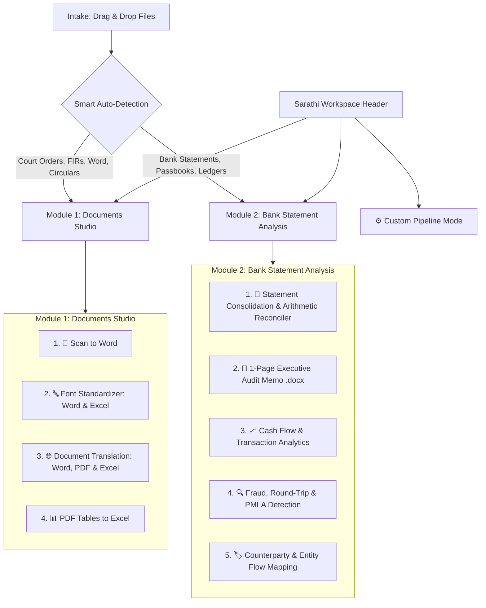

# Sarathi · Operational Purpose & Dual-Module Architecture

> **System:** Sarathi (सारथी) — Local Document & Financial Intelligence Platform  
> **Creator & Architect:** VishNu KumaR  
> **Status:** Authoritative Functional Purpose & Behavioral Specification  
> **Location:** `Vedas/Purpose.md`  
> **Primary Deployment:** 100% Offline-First Local Web Application (`127.0.0.1:8000`)  
> **Design Aesthetic:** Modern, executive-grade dark slate minimalist workstation with progressive disclosure. Clean on the surface, fully loaded under the hood.  

---

## 1. Executive Purpose & Real-World Office Intent

Sarathi is engineered to eliminate high-frequency document bottlenecks encountered daily in Indian legal, administrative, and accounting office environments.

Rather than exposing fragmented technical primitives ("OCR", "Font Converter", "Translation"), Sarathi organizes all capabilities into **Two Primary Operational Modules**, backed by **Smart Auto-Detection** and an **Inline Password Unlocker**:



---

## 2. Document Intake Innovations (Zero-Friction Ingestion)

### 2.1 🔑 Inline PDF Password Unlocker
* **Problem**: In India, almost every e-bank statement and salary slip arrives encrypted with a password (e.g. DOB + last 4 digits, PAN, or Name + DOB).
* **Behavior**:
  - When an encrypted PDF is added, Sarathi immediately flags it in the intake table with an inline key icon 🔑:
    `"Password Required for HDFC_Statement.pdf"`.
  - Operator enters the password once; a toggle provides `"Apply to all locked PDFs in batch"`.
  - The document is unlocked securely in memory without saving plaintext credentials or writing unencrypted intermediate files to disk.

### 2.2 ⚡ Smart Intent Auto-Detection
* **Behavior**:
  - The instant files are dropped, Sarathi's lightweight probe (`identify`) inspects document headers and structure in milliseconds.
  - If financial statement signatures are found (SBI, HDFC, ICICI, PNB layouts or passbook grids) $\rightarrow$ auto-selects **Module 2: Bank Statement Analysis**.
  - If legal petitions, FIRs, Word files, or general notices are found $\rightarrow$ auto-selects **Module 1: Documents Studio**.
  - Operators can override the auto-selection with a single click.

---

## 3. Module 1: Documents Handling (Document Studio)

Dedicated to high-fidelity document conversion, font repair, layout-preserving translation, and tabular data extraction.

### Workflow 1.1: 📄 Scan to Word
* **Office Need**: Scanned notices, paper orders, FIRs, petitions, or old typewriter scans that need to become editable Word documents.
* **Input**: Scanned PDFs or Images (`.pdf`, `.png`, `.jpg`).
* **Deliverable**: Formatted Microsoft Word (`.docx`) with preserved tables, paragraph flow, and margins.
* **Sub-Modes**:
  - **Hindi Word (Clean Unicode)**: Runs OpenVINO RapidOCR on Intel Arc iGPU, detects legacy typewriter glyphs, converts them to standard Unicode Devanagari, and outputs an editable Hindi Word file.
  - **English Word (Translated)**: Runs OCR, repairs legacy fonts, and translates Hindi text into English using the local neural translation engine.

---

### Workflow 1.2: 🔤 Font Standardizer (Word & Excel)
* **Office Need**: Word files or Excel spreadsheets with messy, mixed legacy fonts (Kruti Dev, Devlys, Chanakya, Shusha, Shivaji) that need to be uniform Unicode, or need reverse conversion to Kruti Dev.
* **Input**: Word documents (`.docx`) **AND** Excel spreadsheets (`.xlsx`, `.xls`).
* **Deliverable**: Clean, non-destructive file saved as `[OriginalName]_Unicode.docx` or `[OriginalName]_Unicode.xlsx` (leaving original source intact).
* **Format-Specific Behavior**:
  - **In Word (`.docx`)**: Traverses OpenXML paragraphs, tables, headers, and footers in-place. Converts Kruti Dev / Devlys / Chanakya / Shusha / Shivaji runs into Unicode Devanagari (Mangal / Nirmala UI) while strictly preserving font sizes, colors, highlights, and paragraph geometry.
  - **In Excel (`.xlsx` / `.xls`)**: Scans all worksheet tabs and text cells. Converts legacy Hindi text in column headers and cell strings to Unicode. **Leaves all numbers, dates, currency, and Excel formulas (`=SUM(...)`, etc.) 100% untouched.**
* **Sub-Modes**:
  - **To Unicode Devanagari (Standardize)**: Upgrades all legacy Hindi text to standard Unicode.
  - **Reverse to Legacy Kruti Dev / Devlys**: Transduces modern Unicode text back into Kruti Dev 010 or Devlys 010 for older government printing portals or typewriter systems.

---

### Workflow 1.3: 🌐 Document Translation (Word, PDF & Excel)
* **Office Need**: Complete translation of official circulars, petitions, contracts, or spreadsheets between Hindi and English without losing layout, tables, or formulas.
* **Input**: Word (`.docx`), PDF (`.pdf`), **AND** Excel (`.xlsx`, `.xls`, `.csv`).
* **Deliverable**: Translated Word document, translated PDF, or translated Excel workbook.
* **Language Safeguards**:
  - **Proper Noun Guard**: Automatically protects personal names, judicial officer names, and locations using ISO 15919 phonetic transliteration rules (*Surya Prakash*, not *Sun Light*).
  - **Statutory Glossary**: Guarantees standard administrative and court vocabulary (*Additional Sessions Judge*, *Collector*, *PMLA*, *IPC*).
* **Format-Specific Behavior**:
  - **Word & PDF**: Translates narrative text and table contents with formatting preserved.
  - **Excel Sheets**: Translates text headers and cell narratives into English while keeping cell coordinates, column widths, numbers, and formulas completely intact.
* **Sub-Modes**:
  - **Direction**: `Hindi → English` (default) or `English → Hindi`.
  - **Excel Scope**: `Entire Sheet` vs. `Headers & Descriptions Only`.

---

### Workflow 1.4: 📊 PDF Tables to Excel
* **Office Need**: Extracting non-bank tables (audit schedules, salary statements, inventory sheets, budget allocations) from digital or scanned PDFs directly into clean Excel spreadsheets.
* **Input**: PDF (Digital or Scanned).
* **Deliverable**: Clean Microsoft Excel Workbook (`.xlsx`).
* **Behavior**: Uses vector stroke analysis and table grid detection to rebuild borderless and ruled tables with cell alignments intact, auto-converting legacy fonts in table cells to Unicode.

---

## 4. Module 2: Bank Account Statement Analysis (Financial Intelligence)

Dedicated to bank statement parsing, financial ledger normalization, double-entry mathematical reconciliation, and downstream forensic audit analytics.

### Capability 2.1: 🏦 Statement Consolidation & Arithmetic Reconciler *(Current Production)*
* **Office Need**: Consolidating diverse bank statements (SBI, HDFC, ICICI, PNB, etc.) in various formats into a single standardized Excel ledger with verified math.
* **Input**: Bank statements in PDF (digital/scanned), Excel (`.xlsx`, `.xls`), or CSV.
* **Deliverable**: Master Consolidated Excel Workbook (`.xlsx`) + discrepancy audit report.
* **Unified Canonical Columns**:
  $$\text{Date} \mid \text{Value Date} \mid \text{Description / Narration} \mid \text{Chq / Ref / UTR No} \mid \text{Withdrawal (Dr)} \mid \text{Deposit (Cr)} \mid \text{Running Balance}$$
* **Integrity Features**:
  - **Double-Entry Balance Verification**: Checks $\text{Opening Balance} + \text{Deposits} - \text{Withdrawals} == \text{Closing Balance}$ for every page.
  - **UTR & IFSC Auto-Repair**: Heuristically repairs OCR confusion in 16/22-character alphanumeric codes (`0` vs `O`, `1` vs `I`, `8` vs `B`) and verifies IFSC syntax.
  - **Multi-Month Deduplication**: Eliminates overlapping transactions across consecutive monthly statement files.

---

### Capability 2.2: 📑 1-Page Executive Audit Memo (`.docx` / PDF) *(Production Deliverable)*
* **Purpose**: Generates an authoritative, executive-ready single-page summary for advocates, tax officers, judges, and clients without requiring them to sift through thousands of spreadsheet rows.
* **Included Metrics**:
  - **Period Covered & Accounts Audited**: Date range, bank names, account numbers, and opening/closing balances.
  - **Turnover Volume**: Total credits (inflows) vs. total debits (outflows).
  - **Top 5 Senders & Beneficiaries**: Major entities by transaction volume.
  - **Cash Scrutiny Alert**: Total cash deposits vs. withdrawals (highlighting Section 269ST / high-value cash thresholds).
  - **Reconciliation Status**: Clear badge: `✓ 100% Mathematically Reconciled (0 Discrepancies)`.

---

### Capability 2.3: 📈 Cash Flow & Transaction Pattern Analytics *(Planned Roadmap)*
* **Purpose**: Generates high-level financial health insights, monthly inflows vs. outflows, recurring debit/credit identification, and balance trajectory graphs.
* **Analytics Generated**:
  - Monthly Average Balance (MAB) & Minimum Balance breaches.
  - Salary, EMI, interest credit, and dividend auto-categorization.
  - Cash deposit ratio vs. electronic transfer (NEFT/RTGS/IMPS/UPI) breakdown.

---

### Capability 2.4: 🔍 Fraud, Round-Trip & PMLA Detection *(Planned Roadmap)*
* **Purpose**: Forensic audit tool for investigating suspect transactions, circular routing of funds, and compliance red flags under the Prevention of Money Laundering Act (PMLA).
* **Detectors**:
  - **Circular / Round-Trip Flow**: Identifies funds exiting an account and returning via related parties within short time windows.
  - **Structuring / Smurfing**: Flags cash deposits positioned immediately beneath statutory reporting thresholds (e.g., just under ₹50,000 or ₹10,00,000).
  - **Sudden Velocity Spikes**: Flags dormancies followed by rapid, high-volume credit/debit washouts.

---

### Capability 2.5: 🏷️ Counterparty & Entity Flow Mapping *(Planned Roadmap)*
* **Purpose**: Discovers and maps distinct commercial counterparties, recurring vendors, and related entities across all consolidated accounts.
* **Deliverable**: Counterparty exposure matrix (`.xlsx`) and entity-level flow summary.

---

## 5. ⚙️ Custom Pipeline Mode (Power User Workspace)

A discreet pill toggle in the top-right corner of the Cockpit (`[ ⚙️ Custom Mode ]`) unfolds the modular step-by-step pipeline builder:

1. **Extraction Engine**: `[ PyMuPDF Native ]` `[ OpenVINO RapidOCR (Intel Arc iGPU) ]` `[ Cloud AI ]`
2. **Font Transduction**: `[ None ]` `[ Auto-Unicode ]` `[ Force KrutiDev ]` `[ Force Devlys ]`
3. **Translation**: `[ None ]` `[ Local IndicTrans2 ]` `[ OPUS-MT ]` `[ Cloud AI ]`
4. **Export Target**: `[ Word (.docx) ]` `[ Excel (.xlsx) ]` `[ PDF ]` `[ JSON/CSV ]`
5. **Advanced Engine Sliders**: OCR score thresholds, unclip ratios, GNN layout preservation, statutory ID extraction (PAN, GSTIN, CIN, CNR).

---

## 6. Universal 50/50 Side-by-Side Review Screen (Pariksha)

Regardless of whether a job originated in **Module 1 (Documents)** or **Module 2 (Bank Statements)**, all results pass through the universal **Side-by-Side Verification Screen** before output finalization:

```
┌────────────────────────────────────────────────────────────────────────────────────────────────────────┐
│  Review & Verification  ·  HDFC_Pleading_2026.pdf  ·  Item 3 of 18   [ All (18) | Needs Review (4) ]   │
│  Shortcut: [ Space / Tab ] Jump to Next Issue                       [ ✓ Approve All & Download Output ]│
├───────────────────────────────────────────┬────────────────────────────────────────────────────────────┤
│         ORIGINAL INPUT (LEFT 50%)         │                GENERATED OUTPUT (RIGHT 50%)                │
├───────────────────────────────────────────┼────────────────────────────────────────────────────────────┤
│                                           │                                                            │
│  [ Zoom: 100% ] [ Fit Width ] [ Page 2 ]  │  [ Status: 96% Confidence ] [ Badge: Converted / Balanced ]│
│                                           │                                                            │
│  ┌─────────────────────────────────────┐  │  ┌──────────────────────────────────────────────────────┐  │
│  │                                     │  │  │ (Interactive Editable Text / Table Cell)             │  │
│  │  Source View:                       │  │  │                                                      │  │
│  │  • Scanned Page Crop                │  │  │  Editable text or normalized statement row:          │  │
│  │  • Legacy Kruti Dev Word run        │  │  │  12-Jan-2026 | UTR: HDFC00018492 | Cr: ₹45,000       │  │
│  │  • Original Hindi Excel Cell        │  │  │                                                      │  │
│  │  • Bank Statement Line Crop         │  │  │  [ Highlighted corrected words or balance match ]    │  │
│  │                                     │  │  │                                                      │  │
│  └─────────────────────────────────────┘  │  └──────────────────────────────────────────────────────┘  │
│                                           │                                                            │
├───────────────────────────────────────────┴────────────────────────────────────────────────────────────┤
│  Navigation: [ ← Previous ] [ Next → ]        Actions: [ Reject / Re-run ] [ Edit Text ] [ Accept ✓ ]   │
└────────────────────────────────────────────────────────────────────────────────────────────────────────┘
```

### ⏩ "Jump to Next Issue" Rapid Triage Shortcut
* **Feature**: Operators do not need to manually review hundreds of green, error-free pages.
* **Key Shortcut (`Space` or `Tab`)**: Automatically jumps the viewport to the next item requiring human attention (low-confidence OCR word, font transduction ambiguity, or bank arithmetic discrepancy).

---

## 7. Minimalist Modern Cockpit UI Layout

The interface follows an executive dark slate palette (`#0a0e17` base, `#111827` cards, `rgba(255,255,255,0.08)` micro-borders) with rich micro-animations and zero clutter:

```
┌────────────────────────────────────────────────────────────────────────────────────────────────────────┐
│  SARATHI · Local Intelligence  ·  by : VishNu KumaR                       [ ⚡ Workflows | ⚙️ Custom ] │
├───────────────────────────────────────────────────┬────────────────────────────────────────────────────┤
│               MODULE SELECTOR BAR                 │  [ 📁 Module 1: Documents Studio ] (Active)        │
│                                                   │  [ 🏦 Module 2: Bank Statement Analysis ]          │
├───────────────────────────────────────────────────┼────────────────────────────────────────────────────┤
│             DOCUMENT INTAKE (LEFT 50%)            │            WORKFLOW SELECTION (RIGHT 50%)          │
│                                                   │                                                    │
│  [ Drag & Drop Files Here ]                       │  1. 📄 Scan to Word                                │
│  [ + Add Files ] [ + Add Folder ]                 │     Pills: [ Hindi Word ] [ English Word ]         │
│                                                   │                                                    │
│  Document Inventory Table:                        │  2. 🔤 Font Standardizer (Word & Excel)            │
│  • Pleading_Scan.pdf (Eligible · 1.4 MB)          │     Pills: [ To Unicode ] [ To Kruti Dev ]         │
│  • SBI_Passbook.pdf (🔑 Locked · Enter Password)  │                                                    │
│  • Accounts.xlsx (Eligible · 420 KB)              │  3. 🌐 Document Translation (Word, PDF & Excel)    │
│                                                   │     Pills: [ Hindi → English ] [ English → Hindi ] │
│                                                   │                                                    │
│                                                   │  4. 📊 PDF Tables to Excel                         │
│                                                   │     Pill: [ Extract to .xlsx ]                     │
├───────────────────────────────────────────────────┴────────────────────────────────────────────────────┤
│  Preflight Plan: Ingest → OpenVINO Arc iGPU OCR → Word .docx          [ Start Document Processing ⚡ ]  │
└────────────────────────────────────────────────────────────────────────────────────────────────────────┘
```

---

## 8. Architectural & Security Invariants

1. **Primary Hardware First**:
   All neural translation and OCR operations are tuned specifically for the reference host: **HP Laptop 15-fd1xxx (Intel Core Ultra 5 125H 14-Core CPU + Intel Arc iGPU)** using OpenVINO FP16 shader caches and CTranslate2 AVX2/AVX-VNNI acceleration.
2. **Air-Gapped & Sovereign**:
   All processing occurs 100% locally over loopback `127.0.0.1`. Documents and financial statements never leave the machine unless the operator explicitly selects an external cloud AI adapter.
3. **Fail-Closed Privacy**:
   If an external cloud service fails, times out, or violates security policy, Sarathi fails closed without leaking document paths or plain text.
4. **Formatting & Math Invariance**:
   Document conversions must strictly preserve typography, geometry, and Excel formulas. Financial reconciliations must fail closed on arithmetic discrepancies.
